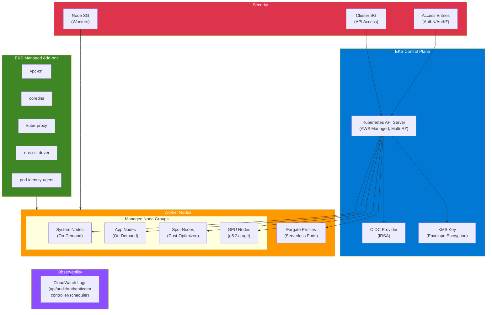

# terraform-aws-eks

Production-grade Terraform module for deploying Amazon EKS clusters with managed node groups, Fargate profiles, IRSA, cluster add-ons, and the EKS Access API.

## Architecture Diagram



## Architecture

```
                            +---------------------------+
                            |     EKS Control Plane     |
                            |  (AWS Managed, Multi-AZ)  |
                            +------+--------+-----------+
                                   |        |
                    +--------------+        +---------------+
                    |                                       |
          +---------v---------+               +-------------v-----------+
          | Control Plane ENIs|               |   OIDC Provider (IRSA)  |
          | (Intra Subnets)   |               |  sts.amazonaws.com      |
          +---+------+------+-+               +-------------------------+
              |      |      |
     +--------v--+ +-v------v-+  +-------------------+
     |  Node SG  | | Cluster  |  |  KMS Key          |
     |  (Workers)| | SG (API) |  |  (Envelope Enc.)  |
     +-----+-----+ +----------+  +-------------------+
           |
     +-----v--------------------------------------------+
     |              Private Subnets (Multi-AZ)          |
     |                                                  |
     | +----------------+ +----------------+ +--------+ |
     | | Managed Node   | | Managed Node   | |Fargate | |
     | | Group: system  | | Group: app     | |Pods    | |
     | | (On-Demand,    | | (On-Demand,    | |        | |
     | |  IMDSv2,       | |  Encrypted EBS)| |        | |
     | |  Encrypted EBS)| +----------------+ +--------+ |
     | +----------------+                               |
     | +----------------+ +----------------+            |
     | | Managed Node   | | Managed Node   |            |
     | | Group: spot    | | Group: gpu     |            |
     | | (Spot,         | | (g5.2xlarge,   |            |
     | |  Tainted)      | |  Tainted)      |            |
     | +----------------+ +----------------+            |
     +--------------------------------------------------+
                            |
              +-------------v--------------+
              |     EKS Managed Add-ons    |
              | vpc-cni | coredns | proxy  |
              | ebs-csi | pod-identity     |
              +----------------------------+

     +--------------------------------------------------+
     |            CloudWatch Logs (Encrypted)           |
     | api | audit | authenticator | controller | sched |
     +--------------------------------------------------+
```

## Features

- **EKS Cluster**: Kubernetes control plane with configurable version and access
- **Managed Node Groups**: Auto-scaling EC2 node groups with launch templates
- **Fargate Profiles**: Serverless Kubernetes pods with namespace selectors
- **IRSA**: IAM Roles for Service Accounts via OIDC federation
- **Cluster Add-ons**: Managed lifecycle for vpc-cni, coredns, kube-proxy, ebs-csi, pod-identity-agent
- **EKS Access API**: Fine-grained cluster authentication and authorization
- **Envelope Encryption**: KMS-based encryption for Kubernetes secrets
- **Security Hardened**: IMDSv2 enforced, private endpoint, encrypted EBS, least-privilege IAM

## Usage

### Minimal

```hcl
module "eks" {
  source = "github.com/kogunlowo123/terraform-aws-eks"

  cluster_name = "my-cluster"
  vpc_id       = "vpc-0123456789abcdef0"
  subnet_ids   = ["subnet-a", "subnet-b", "subnet-c"]

  managed_node_groups = {
    default = {
      name           = "default"
      instance_types = ["m5.large"]
      min_size       = 2
      max_size       = 5
      desired_size   = 3
    }
  }
}
```

### Production

```hcl
module "eks" {
  source = "github.com/kogunlowo123/terraform-aws-eks"

  cluster_name    = "production"
  cluster_version = "1.29"

  vpc_id                   = module.vpc.vpc_id
  subnet_ids               = module.vpc.private_subnet_ids
  control_plane_subnet_ids = module.vpc.intra_subnet_ids

  cluster_endpoint_private_access = true
  cluster_endpoint_public_access  = false

  enable_cluster_encryption  = true
  cluster_log_retention_days = 365

  managed_node_groups = {
    system = {
      name           = "system"
      instance_types = ["m6i.xlarge"]
      capacity_type  = "ON_DEMAND"
      min_size       = 3
      max_size       = 6
      desired_size   = 3
      disk_size      = 100
      ami_type       = "AL2023_x86_64_STANDARD"
      labels         = { "node.kubernetes.io/purpose" = "system" }
      taints = [{
        key    = "CriticalAddonsOnly"
        effect = "NO_SCHEDULE"
      }]
    }
    application = {
      name           = "application"
      instance_types = ["m6i.2xlarge", "m5.2xlarge"]
      capacity_type  = "ON_DEMAND"
      min_size       = 3
      max_size       = 50
      desired_size   = 6
      disk_size      = 200
      ami_type       = "AL2023_x86_64_STANDARD"
    }
  }

  cluster_addons = {
    vpc-cni            = { resolve_conflicts = "OVERWRITE" }
    coredns            = { resolve_conflicts = "OVERWRITE" }
    kube-proxy         = { resolve_conflicts = "OVERWRITE" }
    aws-ebs-csi-driver = { resolve_conflicts = "OVERWRITE" }
  }

  tags = {
    Environment = "production"
    ManagedBy   = "terraform"
  }
}
```

## Security Considerations

### IMDSv2 Enforcement
All managed node groups use launch templates that enforce IMDSv2 (`http_tokens = "required"`), preventing SSRF-based credential theft from the instance metadata service.

### Envelope Encryption
Kubernetes secrets are encrypted at rest using a KMS key. The module can create a dedicated KMS key or use an existing one. Key rotation is enabled by default.

### Private Endpoint
By default, the cluster API server is only accessible via private endpoint (`cluster_endpoint_public_access = false`). Access the cluster through a VPN, bastion host, or AWS SSM Session Manager.

### Least-Privilege IAM
- Each node group gets its own IAM role with only the required managed policies
- Fargate pods use a dedicated execution role with scoped trust policy
- IRSA enables per-pod IAM without sharing node-level credentials

### EBS Encryption
All node group EBS volumes are encrypted using KMS. The launch template enforces encryption at the block device level.

### Security Groups
- Cluster security group allows only HTTPS ingress from worker nodes
- Node security group allows inter-node communication and required control plane ports
- All egress is allowed for pulling container images and communicating with AWS APIs

## Inputs

| Name | Description | Type | Default | Required |
|------|-------------|------|---------|----------|
| cluster_name | Name of the EKS cluster | `string` | - | yes |
| cluster_version | Kubernetes version | `string` | `"1.29"` | no |
| vpc_id | VPC ID | `string` | - | yes |
| subnet_ids | Subnet IDs for worker nodes | `list(string)` | - | yes |
| control_plane_subnet_ids | Subnet IDs for control plane ENIs | `list(string)` | `[]` | no |
| cluster_endpoint_private_access | Enable private API endpoint | `bool` | `true` | no |
| cluster_endpoint_public_access | Enable public API endpoint | `bool` | `false` | no |
| cluster_endpoint_public_access_cidrs | CIDRs for public API access | `list(string)` | `["0.0.0.0/0"]` | no |
| enable_cluster_encryption | Enable KMS envelope encryption | `bool` | `true` | no |
| kms_key_arn | Existing KMS key ARN (creates new if null) | `string` | `null` | no |
| cluster_log_types | Control plane log types | `list(string)` | all 5 types | no |
| cluster_log_retention_days | CloudWatch log retention | `number` | `90` | no |
| managed_node_groups | Map of managed node group configs | `map(object)` | `{}` | no |
| fargate_profiles | Map of Fargate profile configs | `map(object)` | `{}` | no |
| cluster_addons | Map of EKS add-on configs | `map(object)` | `{}` | no |
| enable_irsa | Enable OIDC provider for IRSA | `bool` | `true` | no |
| access_entries | Map of EKS access entries | `map(object)` | `{}` | no |
| tags | Tags for all resources | `map(string)` | `{}` | no |

## Outputs

| Name | Description |
|------|-------------|
| cluster_id | The ID of the EKS cluster |
| cluster_arn | The ARN of the EKS cluster |
| cluster_endpoint | The API server endpoint URL |
| cluster_certificate_authority_data | Base64 encoded cluster CA certificate |
| cluster_security_group_id | Cluster security group ID |
| node_security_group_id | Node security group ID |
| oidc_provider_arn | OIDC provider ARN for IRSA |
| oidc_provider_url | OIDC provider URL |
| node_group_arns | Map of node group ARNs |
| fargate_profile_arns | Map of Fargate profile ARNs |
| cluster_iam_role_arn | Cluster IAM role ARN |
| kms_key_arn | KMS key ARN used for encryption |

## Cost Estimation

| Component | Approximate Monthly Cost |
|-----------|--------------------------|
| EKS Control Plane | $73 |
| m5.large (3 nodes) | $210 |
| m6i.xlarge (3 nodes) | $420 |
| m6i.2xlarge (6 nodes) | $1,680 |
| CloudWatch Logs | Variable |
| KMS Key | $1 |
| NAT Gateway (data transfer) | Variable |

Costs vary by region, instance type, and utilization. Use the [AWS Pricing Calculator](https://calculator.aws/) for precise estimates.

## IAM Permissions Required

The IAM principal running Terraform needs the following permissions:

```json
{
  "Version": "2012-10-17",
  "Statement": [
    {
      "Effect": "Allow",
      "Action": [
        "eks:*",
        "ec2:CreateSecurityGroup",
        "ec2:DeleteSecurityGroup",
        "ec2:AuthorizeSecurityGroupIngress",
        "ec2:AuthorizeSecurityGroupEgress",
        "ec2:RevokeSecurityGroupIngress",
        "ec2:RevokeSecurityGroupEgress",
        "ec2:CreateLaunchTemplate",
        "ec2:DeleteLaunchTemplate",
        "ec2:CreateLaunchTemplateVersion",
        "ec2:DescribeLaunchTemplateVersions",
        "ec2:DescribeSecurityGroups",
        "ec2:DescribeSubnets",
        "ec2:DescribeVpcs",
        "ec2:CreateTags",
        "ec2:DeleteTags",
        "ec2:RunInstances",
        "iam:CreateRole",
        "iam:DeleteRole",
        "iam:AttachRolePolicy",
        "iam:DetachRolePolicy",
        "iam:PutRolePolicy",
        "iam:DeleteRolePolicy",
        "iam:GetRole",
        "iam:ListRolePolicies",
        "iam:ListAttachedRolePolicies",
        "iam:ListInstanceProfilesForRole",
        "iam:PassRole",
        "iam:CreatePolicy",
        "iam:DeletePolicy",
        "iam:GetPolicy",
        "iam:GetPolicyVersion",
        "iam:ListPolicyVersions",
        "iam:CreateOpenIDConnectProvider",
        "iam:DeleteOpenIDConnectProvider",
        "iam:GetOpenIDConnectProvider",
        "kms:CreateKey",
        "kms:CreateAlias",
        "kms:DeleteAlias",
        "kms:DescribeKey",
        "kms:GetKeyPolicy",
        "kms:GetKeyRotationStatus",
        "kms:ListAliases",
        "kms:ListResourceTags",
        "kms:PutKeyPolicy",
        "kms:ScheduleKeyDeletion",
        "kms:TagResource",
        "kms:EnableKeyRotation",
        "logs:CreateLogGroup",
        "logs:DeleteLogGroup",
        "logs:PutRetentionPolicy",
        "logs:DescribeLogGroups",
        "logs:ListTagsLogGroup",
        "logs:TagLogGroup"
      ],
      "Resource": "*"
    }
  ]
}
```

## Submodules

| Module | Description |
|--------|-------------|
| [modules/node-group](./modules/node-group/) | Reusable managed node group with launch template |
| [modules/fargate-profile](./modules/fargate-profile/) | Reusable Fargate profile |
| [modules/irsa](./modules/irsa/) | IAM Roles for Service Accounts helper |

## Examples

| Example | Description |
|---------|-------------|
| [examples/basic](./examples/basic/) | Simple cluster with one node group |
| [examples/advanced](./examples/advanced/) | Multi-node-group with Fargate and Spot |
| [examples/complete](./examples/complete/) | Full enterprise cluster with all features |

## References

- [Amazon EKS User Guide](https://docs.aws.amazon.com/eks/latest/userguide/)
- [EKS Best Practices Guide](https://aws.github.io/aws-eks-best-practices/)
- [EKS Managed Node Groups](https://docs.aws.amazon.com/eks/latest/userguide/managed-node-groups.html)
- [EKS Fargate](https://docs.aws.amazon.com/eks/latest/userguide/fargate.html)
- [IRSA Documentation](https://docs.aws.amazon.com/eks/latest/userguide/iam-roles-for-service-accounts.html)
- [EKS Access Entries](https://docs.aws.amazon.com/eks/latest/userguide/access-entries.html)
- [EKS Add-ons](https://docs.aws.amazon.com/eks/latest/userguide/eks-add-ons.html)
- [Envelope Encryption](https://docs.aws.amazon.com/eks/latest/userguide/enable-kms.html)

## Requirements

| Name | Version |
|------|---------|
| terraform | >= 1.5.0 |
| aws | >= 5.20.0 |
| tls | >= 4.0 |
| kubernetes | >= 2.20 |

## License

MIT License. See [LICENSE](LICENSE) for details.
